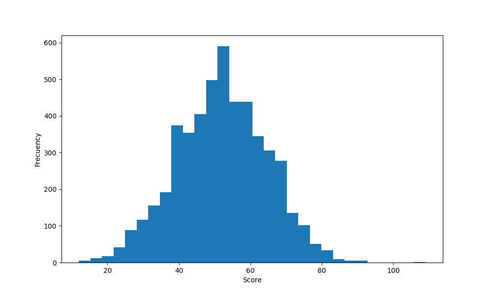

# SNAKE [A* PATHFINDING ALGORITHM]

Study of implementing pathfinding algorithm into snake game.
For this experiment, game has been runned 5000 times and scores has been saved into a CSV file.

Analysing the scores we obtain the following results:

&nbsp;

| STATISTICS    | RESULTS       |
| ------------- |:-------------:|
| Mean          | 52            |
| Max value     | 109           |
| Min value     | 12            |
| Variance      | 158           |
| Strd          | 12.57         |

&nbsp;

Histogram, population 5000

&nbsp;

With this results we can conclude that this algorithm is now very good at playing this game. The average is quite low and the high dispersion in its scores means that the results depend a lot on chance.